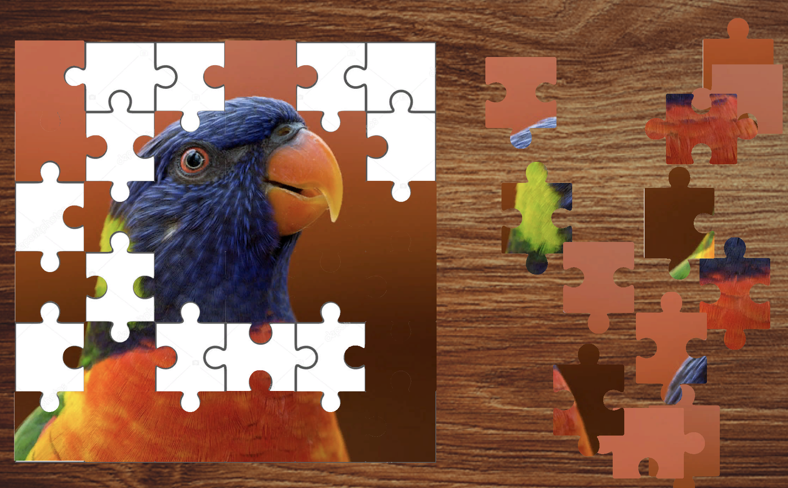

# JigsawPuzzleGame

Puzzle Puzzle is an entertaining and engaging puzzle game developed in Unity. It offers a unique experience where players can choose from a variety of images and break them into small, challenging puzzle pieces. Your objective is to reassemble the pieces correctly to reveal the original image. 

## Features

- Choose from a collection of stunning images.
- Challenge your logical and problem-solving skills.
- Enjoy hours of puzzle-solving fun.
- Explore different levels of difficulty.
- Beautiful graphics and intuitive controls.

## How to Play

1. **Select an Image**: Start by choosing an image from the collection.
2. **Break it Down**: The chosen image will be broken into puzzle pieces.
3. **Reassemble**: Drag and drop the pieces to recreate the original image.
4. **Complete the Puzzle**: Continue until you successfully complete the puzzle!
